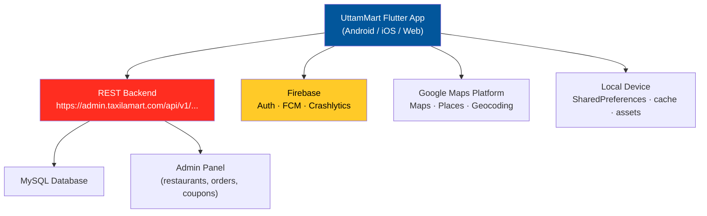

<p align="center">
  
</p>

<p align="center">
  
  
  
  
  
</p>

# 🛵 UttamMart

**A full-featured food delivery customer app built with Flutter** — browse restaurants, search dishes, manage a cart, check out, pay, chat with the restaurant, and track your order live on a map.

> **Developed by [Arslan Malik](https://github.com/arsalanmaalik461)**
> 📱 WhatsApp: [+92 300 8987448](https://wa.me/923008987448) · 🌐 Website: [arslanmalik.tech](https://arslanmalik.tech)

---

## 🌟 Executive Overview

UttamMart is the customer-facing mobile app of a food-delivery platform, written entirely in Dart/Flutter for Android, iOS, and Web from a single codebase. It talks to a REST backend (`/api/v1/...`, currently wired to `https://admin.taxilamart.com`) for everything dynamic — restaurant and menu catalogs, coupons, orders, chat messages, and payments — while Firebase powers push notifications, social authentication, and crash reporting.

The app is organized into ~30 feature modules under `lib/features/` (auth, cart, checkout, order, track, chat, payment, coupon, flash sale, wishlist, and more), with a `Provider` + `GetIt` state-management setup and `go_router` for deep-linkable navigation. Maps and live order tracking run on Google Maps + geolocator, and the whole UI is localized and ships with light and dark themes.

The build is production-branded: Android package `com.app.uttammart_user`, app label **UTTAMMART**, version **7.4**, with Firebase wired through `lib/firebase_options.dart` (FlutterFire) plus the platform `google-services.json` / iOS plist.

---

## 📑 Table of Contents

- [✨ Key Features & Highlights](#-key-features--highlights)
- [🖥️ Feature Showcase](#️-feature-showcase)
- [🏗️ System Architecture](#️-system-architecture)
- [🚀 Quickstart & Installation Guide](#-quickstart--installation-guide)
- [📂 Project Structure](#-project-structure)
- [🛡️ Security & Notes](#️-security--notes)

---

## ✨ Key Features & Highlights

| Feature | Description |
| :--- | :--- |
| 🔐 Multi-login auth | Phone/OTP (PIN-code fields), email, plus Google, Facebook & Apple sign-in via Firebase Auth |
| 🏪 Restaurant & menu browsing | Categories, banners, carousels, flash-sale deals, discounted products, staggered product grids |
| 🔎 Smart search | Type-ahead search across products with search history (`flutter_typeahead`) |
| 🛒 Cart & checkout | Multi-item cart, saved delivery addresses, coupon apply, order placement |
| 💳 Payments | Dedicated payment module wired to backend gateways (in-app webview supported) |
| 📍 Live order tracking | Real-time delivery tracking on Google Maps with geolocation & geocoding |
| 💬 In-app chat | Two-way chat with the restaurant during an active order |
| 🔔 Push notifications | Firebase Cloud Messaging + local notifications (custom `notification.wav`) |
| ⭐ Ratings & reviews | Rate restaurants/dishes, read reviews |
| ❤️ Wishlist | Save favourite products/restaurants |
| 🎟️ Coupons & flash sales | Coupon list/apply and time-limited flash-sale products |
| 🌍 Multi-language + themes | Full localization support and light/dark theme switching |
| 📦 Maintenance & update modes | Built-in force-update and maintenance-mode screens |
| 🍪 Web-ready | Responsive web build with URL strategy & cookies banner |

---

## 🖥️ Feature Showcase

### 1. 🔐 Authentication & Onboarding

> "Sign in with phone, email, Google, Facebook or Apple — verified with OTP, localized from the first screen."

- Onboarding walkthrough, language selection, and welcome screens on first launch
- OTP verification flows for phone and email (`pin_code_fields`)
- Social sign-in via Firebase Auth, Google Sign-In, Facebook Auth, and Sign in with Apple
- Password reset / forgot-password flow backed by the auth API

### 2. 🛒 Catalog, Cart & Checkout

> "Browse → search → cart → coupon → checkout: the whole food-ordering funnel in one smooth flow."

- Home dashboard with banners, categories, flash sales, and latest/discounted products
- Product detail pages with photo gallery (`photo_view`), variants, and add-ons
- Cart with quantity controls, coupon application, and multiple saved addresses
- Checkout screen computing totals before placing the order via `/api/v1/customer/order/place`

### 3. 📍 Order Tracking & Chat

> "Watch your food move on a live map — and message the restaurant if anything changes."

- Live map tracking screen (Google Maps) with delivery-rider position updates
- Order list with status timeline: placed → confirmed → cooking → on the way → delivered
- In-app chat thread per order (message send/receive via `/api/v1/customer/message/*`)
- Push notifications on every order status change

### 4. 💳 Payments & Notifications

> "Pay how you like, and never miss a status update."

- Payment module with in-app webview support for gateway redirects (`flutter_inappwebview`)
- Transaction history tied to the customer profile
- FCM token registration (`/api/v1/customer/cm-firebase-token`) + local notification rendering
- Firebase Crashlytics for production crash reporting

---

## 🏗️ System Architecture



**Stack:** Flutter 3.4+ / Dart · Provider + GetIt (state) · go_router (navigation) · Dio + http (networking) · Firebase Auth / Messaging / Crashlytics · Google Maps Flutter · SharedPreferences (local storage) · flutter_localizations (i18n).

---

## 🚀 Quickstart & Installation Guide

### Prerequisites

- [Flutter SDK](https://docs.flutter.dev/get-started/install) **3.4.0 or newer** (Dart bundled)
- Android Studio / Xcode for emulator or device builds
- The bundled Firebase config already targets the UttamMart project (`lib/firebase_options.dart`, `google-services.json`, iOS plist)
- Backend server reachable at `https://admin.taxilamart.com` (or your own — see step 2)

### Step-by-Step Installation

```bash
# 1. Clone the repo
git clone https://github.com/arsalanmaalik461/uttammart.git
cd uttammart

# 2. (Optional) Retarget the backend
#    Edit lib/utill/app_constants.dart and change:
#      static const String baseUrl = 'https://admin.taxilamart.com';
#    to your own server URL.

# 3. Install dependencies
flutter pub get

# 4. Run on a connected device / emulator
flutter run

# 5. Build release APK
flutter build apk --release
```

---

## 📂 Project Structure

```
uttammart/
├── lib/
│   ├── main.dart                 # App entry point, provider tree, routing
│   ├── firebase_options.dart     # FlutterFire project config
│   ├── di_container.dart         # GetIt service registration
│   ├── common/                   # Shared widgets, models, enums
│   ├── data/datasource/remote/   # Dio API clients
│   ├── features/                 # ~30 feature modules
│   │   ├── auth/                 # login, register, OTP, social sign-in
│   │   ├── home/                 # dashboard, banners, categories
│   │   ├── product/              # product list & detail
│   │   ├── cart/ checkout/       # cart + checkout flow
│   │   ├── payment/              # payment screens & gateways
│   │   ├── order/ track/         # orders + live map tracking
│   │   ├── chat/                 # in-app restaurant chat
│   │   ├── coupon/ flash_sale/   # promos & deals
│   │   ├── notification/         # push & in-app notifications
│   │   ├── profile/ address/     # account & addresses
│   │   ├── wishlist/ rate_review/# favourites & reviews
│   │   ├── search/ menu/         # search & category menus
│   │   ├── language/ onboarding/ # locale + first-run screens
│   │   ├── splash/ update/       # startup, force-update
│   │   ├── maintanance/ support/ # maintenance & help
│   │   └── html/ welcome_screen/ # static pages & welcome
│   ├── helper/                   # notification, API, route helpers
│   ├── localization/             # i18n language files
│   ├── provider/                 # theme, language, localization
│   ├── theme/                    # light_theme / dark_theme
│   └── utill/                    # app_constants, images, styles, routes
├── assets/                       # fonts, icons, images, svg, sounds
├── android/                      # com.app.uttammart_user (v7.4)
├── ios/                          # iOS runner + Firebase plist
├── web/                          # web build entry
├── test/                         # widget tests
└── pubspec.yaml                  # dependencies & assets
```

---

## 🛡️ Security & Notes

- The repo ships with Firebase config files (`lib/firebase_options.dart`, `google-services.json`, iOS `GoogleService-Info.plist`) committed — fine for a demo, but rotate/replace keys for production builds and consider moving secrets out of the repo.
- OTP, social sign-in, and password-reset flows delegate to the backend + Firebase — never store user tokens in plain text; the app uses `shared_preferences` only for session tokens and settings.
- Location, camera, notification, and storage permissions are requested at runtime (`permission_handler`) — review them against your store-listing privacy policy.
- The default backend URL is a live server (`https://admin.taxilamart.com`); change `AppConstants.baseUrl` if you fork this for your own project.
- Release builds require a valid Firebase project matching the package name `com.app.uttammart_user` if you keep the bundled config files.

---

<p align="center">
  <sub>Developed with ❤️ by <a href="https://github.com/arsalanmaalik461">Arslan Malik</a> · 📱 <a href="https://wa.me/923008987448">WhatsApp: +92 300 8987448</a> · 🌐 <a href="https://arslanmalik.tech">arslanmalik.tech</a></sub>
</p>
